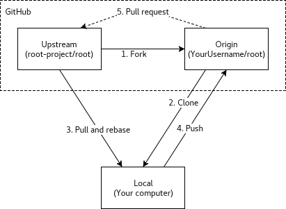

# Git-example

# General overview of Fork/Pull-Request:

The following steps describe the flow in the picture below.




## 1. Fork the repository via Web [URL_Repository]
Via Web create a new `fork` of the main Upstream repository

## 2. Clone the Forked repository to our local machine
* Clone the forked repository
```
$ git clone [Fork_URL_Repository]
```

* 2.1 We add the upstream, i.e., the remote main repository. This is done *only ONCE* for a new local copy of our forked repository
```
$ cd [Directory_cloned_repository]
$ git remote add upstream [URL_MAIN_Repository]
```

## 3. Update our local copy of the fork with the latest version of the Upstream repository (a.k.a *Pull and Rebase*)

BEFORE any change or work in the local copy, get the latest version of the Upstream repository and update the Fork. In this case the fork will be updated in the `master branch`

* Switch to the master branch
```
$ git checkout master
```

* Get the latest version of the `master` branch from the `upstream` and merge it with the local copy current branch (`master`)
```
$ git pull upstream master
```

## 4. Push changes into the Fork
* Push the merged local copy to update the fork
```
$ git push origin master
```

## 5. Create the new branch for the `feature` to work on and Send the `Pull request`

* Create the new branch to work on
```
$ git checkout -b feature_xyz 
```

* *Work on all changes and modify code in local repository ...*


* Add the files/directories with changes to be commited
```
$ git add FILE1, FILE2, ...
```

* Verify the files to be commited
```
$ git status
```

* Commit changes with a message using option `-m` (*or use any local editor skipping `-m` option*)
```
$ git commit -m "Commit change xyz"
```


* Push the changes into the branch `feature_xyz` of the Fork
```
$ git push origin feature_xyz
```

* Send the `Pull Request` via web


## 8. Verify changes and update the Fork
Once the `Pull request` has been reviewed, accepted and merged, be sure to update the fork again. This process is just to verify that the latest change sent from the branch as `pull request` is now in the `master` branch of the local copy and the fork.

* Be sure to be in the `master` branch of the local copy
```
$ git checkout master
```

* Fetch the latest changes (these are the changes sent with the `pull request`)
```
git pull upstream master
```

* Push the changes into the Fork
```
$ git push origin master
```

## 9. Verify in Web that the Fork main branch has all changes


**Important Note**: *The steps in this tutorial refer to `main` branch as `master` branch. The name of the `master` branch was recently changed in Github. If the forked/cloned repository refers to the main branch as the new name `main`, then just change the corresponding commands.*

